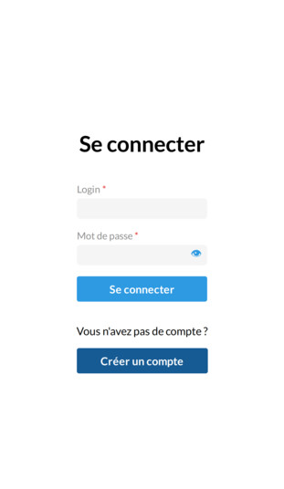
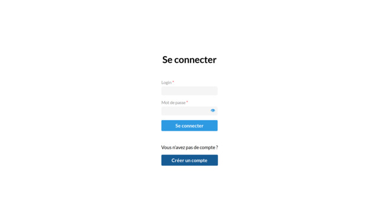
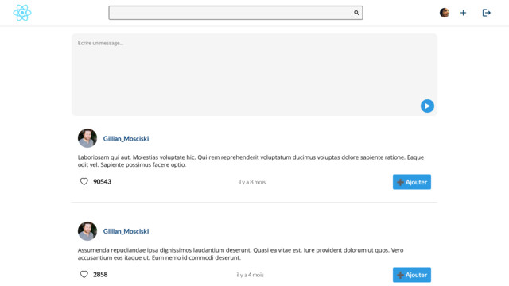
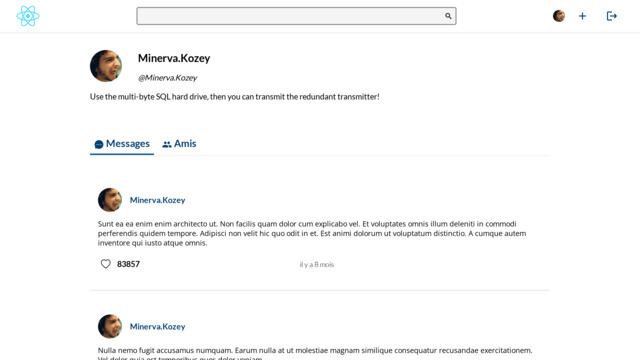
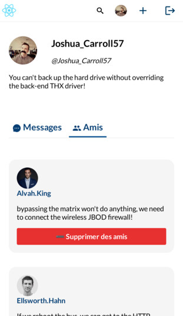
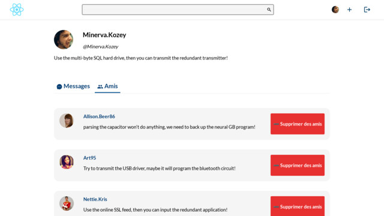

# Chwitter

## Twitter, but it's lame.

[](https://github.com/musikid/chwitter/actions/workflows/test.yml)


---

## API documentation

https://musikid.github.io/chwitter/api/docs/html

## Build

Build instructions are available for each package.

### Due to [#10695](https://github.com/facebook/create-react-app/issues/10695), the `common` package needs to be built manually.

```sh
cd common
pnpm build
```

### Docker

```sh
docker build . -t musikid/chwitter
```

## Status

The project is complete.

## Features

- Likes
- Search function
- Add/remove friends
- Create/remove messages
- Light/Dark mode
- Edit profile

## Highlights

### Responsive

|                    | Mobile                                                    | Desktop                                                    |
| ------------------ | --------------------------------------------------------- | ---------------------------------------------------------- |
| Login              |              |              |
| Home Feed          |                |                |
| Profile - Messages |     |     |
| Profile - Friends  |  |  |

### Minimal

React, dayjs and classnames are the only dependencies for the client,
Express and mongoose/typegoose for the server.

## FAQ

### Why?

Because school.

### Will it work one day?

Not gonna make it for production.
