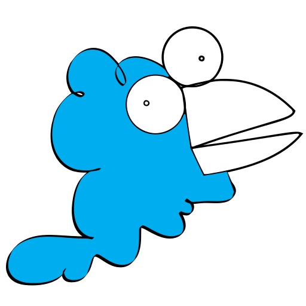

# Chwitter

Twitter, mais en moins bien.

{ height=250px width=250px }

[https://github.com/musikid/chwitter](https://github.com/musikid/chwitter)

- $BINOME_1$ (musikid) 
  - Client
  - Présentation
  - Tests 
  - Déploiement
- $BINOME_2$
  - Serveur

# Sommaire

## Client

- Architecture
- Démonstration / Exemple de communication
- Fonctionnalités supplémentaires

## Serveur

- Présentation des services
- Exemple
- Tests
- Session (cookie-session)
- Fonctionnalités supplémentaires

## Conclusion

- Difficultés rencontrées
- Déploiement (Heroku × MongoDB Atlas × Docker)

# Fonctionnalités manquantes

Aucune !

# Architecture

## Providers

- Contexte d'authentification (`AuthProvider`)
- Contexte de notification (`ToastProvider`)

## Pages

- Accessibles par URL (`react-router`)
- Composants avec états
- Peut faire appel aux services (à travers le hook `useService`)

## Composants

- Stateless (sans état)
- Toute l'information transmise par les props

## Service

- Retourne une réponse typé de l'API
- Asynchrone (`Promise`)
- Peut être annulé (`AbortController`),
  utile lorsqu'un composant est démonté et la requête n'est pas terminée

<section data-background-iframe="../graphs/client-graph.html"
          data-background-interactive
          data-preload>
</section>

## Graphe

# Démonstration

[https://musikid.github.io/chwitter](https://musikid.github.io/chwitter)

## Création de compte

## Client

## **Login.tsx**

```typescript
const loginAction: FormEventHandler<HTMLFormElement> = (e) => {
  e.preventDefault();

  if (!registerView || (registerView && confirmPass === password)) {
    const action = registerView ? register : signIn;
    action({ name, password }, (err) => {
      if (err) report({ severity: Severity.ERROR, error: err });
      else navigate(before, { replace: true });
    });
  }
};
```

## **AuthProvider.tsx**

Note : `useService` n'est pas utilisé car le provider ne doit pas être démonté.

```typescript
const signIn = (loginInfo: LoginParams | null, cb?: MaybeErrorCallback) => {
  const controller = new AbortController();
  return login(loginInfo, controller.signal)
    .then((user) => setUser(new User(user)))
    .then(cb)
    .catch(cb);
};

const register = (registerInfo: RegisterParams, cb?: MaybeErrorCallback) => {
  const controller = new AbortController();
  return registerService(registerInfo, controller.signal)
    .then((user) => setUser(new User(user)))
    .then(cb)
    .catch(cb);
};
```

## **services/user.ts**

```typescript
export const register: Service<RegisterParams, UserResponse> = async (
  registerInfo,
  signal
) => {
  const res = await axios.post<UserResponse>(
    "/api/users",
    { ...registerInfo },
    { signal }
  );

  return res.data;
};
```


## Serveur

## **routes/user.ts**

```
/**
 * POST /api/users/
 * @tags User - User related services
 * @summary Create user
 * @param {RegisterParams} request.body.required - user params
 * @return {UserResponse} 201 - Created user
 */
routes.post("/", async (req, res, next) => {
  try {
    const { name, password }: RegisterParams = req.body;
    const avatar = await sharp(
      Buffer.from(
        createAvatar(avatarStyle, {
          seed: name,
        })
      )
    )
      .resize(96, 96)
      .avif({ lossless: true })
      .toBuffer();
    const newUser = await UserModel.create({ name, password, avatar });

    req.session!.userId! = newUser.id;

    return res.status(201).json(
      newUser.toJSON({
        custom: {
          isFriend: false,
          avatarLink: getAvatarLink(newUser.id!),
        },
      })
    );
  } catch (e) {
    return next(e);
  }
});
```
# Fonctionnalités supplémentaires

- Thème clair/sombre
- Affichage d'avatars
- Likes pour les messages
- statistiques pour les amis/messages/likes
- édition du profil

# Serveur

  <iframe width="1800px" height="500px" data-src="../graphs/server-graph.html"
            data-preload>
  </iframe>

# Services

<section data-background-iframe="https://musikid.github.io/chwitter/api/docs/html"
          data-background-interactive
          data-preload>
</section>

# Session

- Gestion à l'aide de `cookie-session`
- Stockage sur client (cookie)
- Cookie chiffré côté client, puis déchiffré côté serveur
- Très léger (contient seulement l'ID utilisateur)

```typescript
export interface CookieSessionObject {
      userId: string;
}

```

# Tests

- Jest (équivalent à Mocha, différences mineures)
- API Users, Messages et Friends
- "Coverage" inférieur à 100%
- GitHub Actions

# Fonctionnalités supplémentaires

- Génération d'avatars
- Likes pour les messages
- Génération de la documentation automatique ([`/api/docs/html`](#services))
- Compatible OpenAPI (`/api/docs/json`)

# Conclusion

## Difficultés

- Impossible de travailler sur les ordinateurs de l'université
- Instruction parfois peu précises

## Points positifs

- Cahier des charges assez libre
- Technologies actuelles (à jour)
- Ouverture sur le monde professionnel

## Déploiement du projet

- Génération d'une image Docker (Dockerfile)
- Déployé sur Heroku
- Base de données hébergée sur MongoDB Atlas
- Disponible sur [https://musikid.github.io/chwitter](https://musikid.github.io/chwitter)
